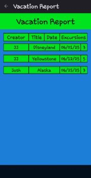

# VacationPlannerMobileApplication
- Plan it.
- Remember it.
- Share it.
- Carry your entire trip in your pocket.

## Table of Contents

[Features](#features)

[Preview](#preview)

[Download](#download)

[Quick Start Guide](#quick-start-guide)

[Build From Source](#build-from-source)

[Requirements & Permissions](https://github.com/Jwonka/VacationPlannerMobileApplication#requirementspermissions)

[Tech Stack & Architecture](https://github.com/Jwonka/VacationPlannerMobileApplication#techstackarchitecture)

[Privacy](#privacy)

[License](#license)

## Features

- Unlimited vacations – Create as many trips as you like, each with its own title, date range, and location.

- Excursions & Day‑plans – Create unlimited excursions inside a vacation, and assign each an exact date/time.

- Smart reminders – Receive Android notifications before every excursion (custom lead‑time per activity).

- Search & Join trips – Filter vacations by date range and RSVP to friends’ public trips.

- One‑tap sharing – Export the full schedule via plain‑text, email, SMS, or clipboard.

- Admin mode – The very first account created becomes the administrator with full CRUD control.

## Preview

    
 

## Download

File ~ sha256sum app-release.apk

Size ~ 5,164KB

Android will prompt once to “Allow installs from unknown sources.” Accept to complete the installation.

## Quick Start Guide
1. On your Android device,  download [`VacationPlanner‑v1.0.2.apk`](https://github.com/Jwonka/VacationPlannerMobileApplication/releases/download/v1.0.2/app-release.apk).
2. When prompted, allow your browser to install unknown apps **(one‑time toggle).**
3. Tap the downloaded file to install.
4. Launch **Vacation Planner** from your app drawer.
5. Create the first account → You are now the administrator.

## Build From Source
Clone the repo
- git clone [https://github.com/Jwonka/VacationPlannerMobileApplication/tree/main](https://github.com/Jwonka/VacationPlannerMobileApplication/tree/main)
- cd VacationPlannerMobileApplication

Build with Android Studio Meerkat 2024.3.2
OR from the command line
./gradlew assembleRelease

## Requirements & Permissions

- Min SDK ~ API 26 (Android 8.0 Oreo)

- Target SDK ~ API 34 (Android 14)

- Architecture ~ arm64‑v8a, armeabi‑v7a, x86_64

App‑level runtime permissions:

- POST_NOTIFICATIONS  – send excursion reminders

- WRITE_EXTERNAL_STORAGE (optional, export share) – export schedule to a text file

## Tech Stack & Architecture

- Language: Java 17 (Android Desugaring) 

- UI: Jetpack ConstraintLayout, Material 3

- Architecture pattern: MVVM (ViewModel + LiveData)

- Persistence: Room

- Build: Gradle 8, Android Plugin = 8.x

## Privacy
All data is stored locally on‑device; no personal data ever leaves your phone. There is no remote server, cloud sync, or analytics in version 1.0.2.

## License
This project is licensed under the MIT [License](https://github.com/Jwonka/VacationPlannerMobileApplication/blob/main/LICENSE) – see the LICENSE file for details.

# - ⚡ Built in Wisconsin
